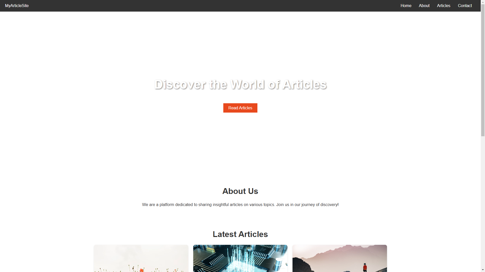
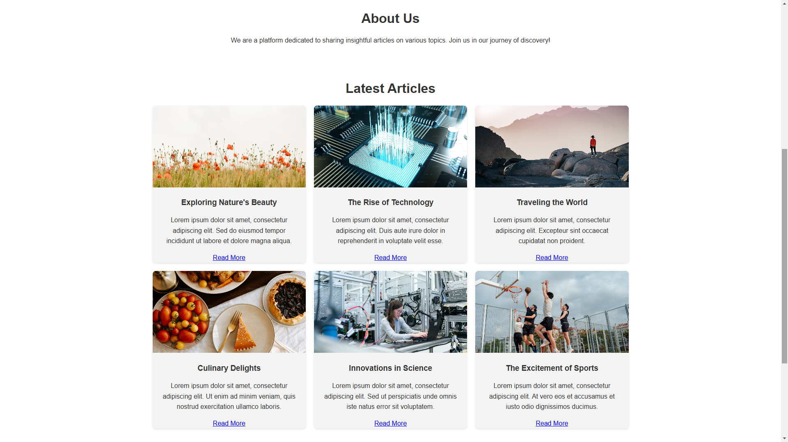
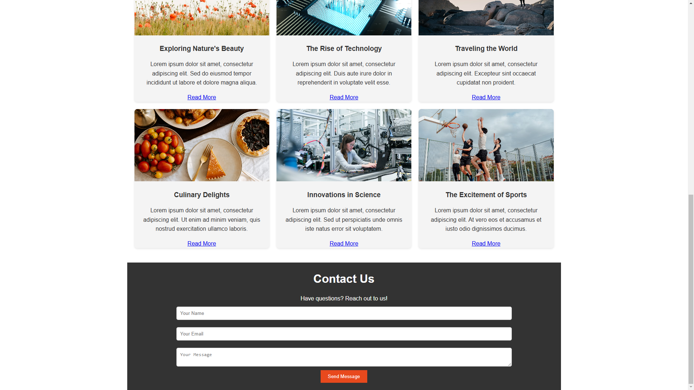

# Article Posting Website

This repository contains the source code for a simple, responsive article posting website. The project demonstrates a clean, minimalistic design with basic HTML, CSS, and JavaScript to create an engaging platform for reading and exploring articles.

## Features

- **Responsive Design**: The website is optimized for both desktop and mobile devices.
- **Hero Section**: A visually appealing introduction with a call-to-action button.
- **Navigation Bar**: Smooth scrolling navigation links to different sections.
- **Article Grid**: A modern grid layout for showcasing articles with images and short descriptions.
- **Contact Form**: A simple contact form with input fields and a "Send Message" button.
- **Interactive UI**: Includes hover effects, a submission alert, and smooth scrolling.

## Usage
- **Navigation**: Use the navigation bar to scroll smoothly between sections (Home, About, Articles, Contact).
- **Articles**: Browse the latest articles displayed in a responsive grid.
- **Contact Form**: Fill out and submit the form to see a success message.

## Technologies Used
- **HTML5**: For the structure of the website.
- **CSS3**: For styling and responsive design.
- **JavaScript**: For interactivity, such as smooth scrolling and form handling.

## Future Improvements
- Add a backend to handle contact form submissions.
- Implement dynamic article loading from a database or CMS.
- Enhance accessibility and SEO features.

## Contact
If you have any questions or feedback, feel free to reach out via the contact form on the website or directly via email: habibur@hrtechcity.com.

## 🖼️ Screenshots
- **Screenshot 01**

- **Screenshot 02**

- **Screenshot 03**

